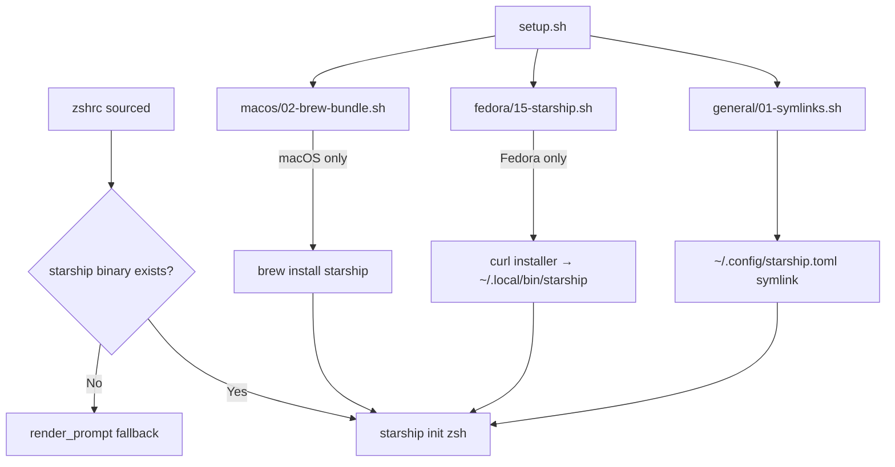

# Requirements

### Overview & Goals

Add **Starship** as the primary shell prompt, with the current hand-rolled `render_prompt` function kept as a graceful fallback when Starship is not installed. This makes the README accurate (it already claims Starship is used) and gives a richer, more informative prompt out of the box.

### Scope

**In Scope:**
- Create a full-featured `starship.toml` in the repo root
- Modify `zshrc` Prompt section: Starship-first, fallback to current `render_prompt`
- Add Starship to macOS Brewfile
- Create a Fedora setup step (`setup/fedora/15-starship.sh`) that installs Starship via the official curl installer
- Symlink `starship.toml` → `~/.config/starship.toml`
- Update README.md to reflect the actual implementation

**Out of Scope:**
- Removing the existing `render_prompt` function (it stays as fallback)
- Changing any other zshrc sections
- Fedora Atomic Starship setup (separate follow-up if needed)

# Technical Design

### Current Implementation

The Prompt section in `zshrc` (lines 276–287) uses a hardcoded `render_prompt` function assigned to `precmd_functions`:

```zsh
precmd_functions=(render_prompt)

function render_prompt {
  PROMPT=""
  PROMPT+="%(1j.%B%%%b .)"
  PROMPT+="%~ "
  PROMPT+="%(?.%F{green}.%F{red})%B$%b%f "
  RPROMPT="%(?..%F{red}[%?]%f)"
}
```

Starship is not referenced anywhere in `zshrc`. No `starship.toml` exists in the repo. Starship is not listed in any package manifest (`Brewfile`, `dnf.txt`, `pacman.txt`, `aur.txt`). The README.md incorrectly claims Starship is used.

### Key Decisions

- **Starship-first with fallback**: Use `if command -v starship` guard — when available, `eval "$(starship init zsh)"`; otherwise, keep the existing `render_prompt`. This follows the established zshrc pattern used by FZF, TheFuck, Tailscale, and others.
- **Full-featured `starship.toml`**: Enable most modules with auto-detection so context (git, language versions, etc.) appears only when relevant. This is the user's stated preference.
- **Linux install via curl installer in Fedora setup**: Use the official `https://starship.rs/install.sh` script rather than distro packages. This ensures the latest version and avoids adding Starship to `dnf.txt` / `pacman.txt`. A new Fedora-specific step (`setup/fedora/15-starship.sh`) handles this, following the same pattern as `12-bun.sh` and `13-junie.sh`.
- **macOS install via Homebrew**: Add `brew "starship"` to the Brewfile — consistent with how all other macOS CLI tools are managed.

### Proposed Changes

#### 1. New file: `starship.toml`

Full-featured Starship config at repo root. Key modules:
- `character` — green `$` on success, red `$` on failure (mirrors current behavior)
- `directory` — truncated path with repo root detection
- `jobs` — background job indicator (mirrors current `%(1j...)` )
- `status` — exit code display on failure (mirrors current RPROMPT)
- `git_branch`, `git_status`, `git_state`, `git_commit` — full git context
- `cmd_duration` — show how long the last command took
- `nodejs`, `python`, `java`, `golang`, `rust`, `bun`, `dotnet` — language versions when detected
- `docker_context` — show active Docker context
- `package` — show project package version
- Plus: `aws`, `gcloud`, `kubernetes`, `terraform`, and other common modules

#### 2. Modified: `zshrc` (Prompt section, lines 276–287)

```zsh
##########

# Prompt

##########
if command -v starship >/dev/null 2>&1; then
  eval "$(starship init zsh)"
else
  precmd_functions=(render_prompt)

  function render_prompt {
    PROMPT=""
    PROMPT+="%(1j.%B%%%b .)"
    PROMPT+="%~ "
    PROMPT+="%(?.%F{green}.%F{red})%B$%b%f "
    RPROMPT="%(?..%F{red}[%?]%f)"
  }
fi
```

#### 3. Modified: `setup/macos/Brewfile`

Add `brew "starship"` in alphabetical order (after `sqlite`, before `strace`-equivalent position).

#### 4. New file: `setup/fedora/15-starship.sh`

Follows the same pattern as `setup/fedora/12-bun.sh` and `setup/fedora/13-junie.sh` — sources `setup/general/common.bash`, implements `presteps()` (require curl), `help()`, and `run()`. Runs `curl -sS https://starship.rs/install.sh | sh -s -- -y` to install Starship to `~/.local/bin`. Idempotent: checks for existing `starship` binary before installing. This step only runs on Fedora (regular), not on macOS or Fedora Atomic.

#### 5. Modified: `setup/general/01-symlinks.sh`

Add: `ensure_symlink "$REPO_DIR/starship.toml" "$HOME/.config/starship.toml"`

#### 6. Modified: `README.md`

- Prompt section: describe Starship-first with fallback
- Repository Layout table: update zshrc description
- Remove "Write a `starship.toml`" recommendation

### Data Models / Contracts

**`starship.toml`** — standard Starship configuration (TOML format). See https://starship.rs/config/ for the full schema.

**Setup step contract** (`setup/fedora/15-starship.sh`):
```bash
presteps() { require_command curl; }
help()    { echo "Install Starship prompt via official installer"; }
run()     { /* check for existing binary, run curl installer */ }
```

### File Structure

```
config/
├── starship.toml                  # NEW — Starship configuration
├── zshrc                          # MODIFIED — Prompt section (lines 276–287)
├── README.md                      # MODIFIED — Prompt description + recommendations
└── setup/
    ├── general/
    │   └── 01-symlinks.sh         # MODIFIED — add starship.toml symlink
    ├── fedora/
    │   └── 15-starship.sh         # NEW — curl installer step (Fedora only)
    └── macos/
        └── Brewfile               # MODIFIED — add brew "starship"
```

### Architecture Diagram



### Risks

- **`~/.local/bin` not in PATH on Linux**: The curl installer places Starship in `~/.local/bin`. The zshrc already adds `$HOME/.local/bin` to PATH (line 322, for Junie), so this is covered.
- **Starship init overhead**: `starship init zsh` adds a small overhead to shell startup. This is inherent to Starship and acceptable given the feature gain. The fallback path has zero overhead.
- **Symlink order**: The `starship.toml` symlink must exist before Starship runs. Since `01-symlinks.sh` runs before any tool installation steps, and Starship gracefully handles a missing config file (uses defaults), this is not a real issue.

# Delivery Steps

### ✓ Step 1: Create starship.toml with full-featured configuration
Create a full-featured Starship configuration file at the repo root.

- Create `starship.toml` with modules enabled: directory, character (green/red $), jobs, status (exit code), git_branch, git_status, git_commit, git_state, cmd_duration, nodejs, python, java, golang, rust, docker_context, bun, package, and more.
- Mirror the current prompt's key behaviors: green `$` on success / red `$` on failure, job count indicator, exit code display.
- Use Starship's auto-detection so modules only appear when relevant (e.g., Node.js version only shows in Node projects).

### ✓ Step 2: Modify zshrc prompt section for Starship with fallback
Replace the hardcoded `render_prompt` with Starship-first logic that falls back to the current custom prompt.

- In the Prompt section (lines 276–287), wrap the existing `render_prompt` function in an `else` branch.
- Add an `if command -v starship` guard that runs `eval "$(starship init zsh)"` when Starship is available.
- Keep the existing `render_prompt` function intact as the fallback for when Starship is not installed.
- Follow the existing zshrc pattern for optional tools (e.g., FZF at lines 308–310, TheFuck at lines 407–409).

### ✓ Step 3: Update package manifests and setup scripts for Starship installation
Add Starship to all platform package manifests and setup infrastructure.

- Add `brew "starship"` to `setup/macos/Brewfile` (macOS install).
- Create `setup/fedora/15-starship.sh` — a Fedora-specific setup step that installs Starship via the official curl installer (`curl -sS https://starship.rs/install.sh | sh -s -- -y`). Follows the same pattern as `setup/fedora/12-bun.sh` and `setup/fedora/13-junie.sh`: sources `setup/general/common.bash`, implements `presteps()` (require curl), `help()`, and `run()` with idempotency check.
- Add `ensure_symlink "$REPO_DIR/starship.toml" "$HOME/.config/starship.toml"` to `setup/general/01-symlinks.sh` so the config is symlinked into place.

### ✓ Step 4: Update README.md to reflect Starship integration
Sync the README.md with the actual implementation.

- Update the Prompt section (lines 376–378) to describe the Starship-first approach with fallback to the custom prompt.
- Update the zshrc description in the Repository Layout table (line 73) to reflect the current state.
- Remove the "Write a `starship.toml`" recommendation (line 727) since it will now exist.
- Ensure the TODO checkboxes (lines 738, 753, 767, 781) remain accurate.