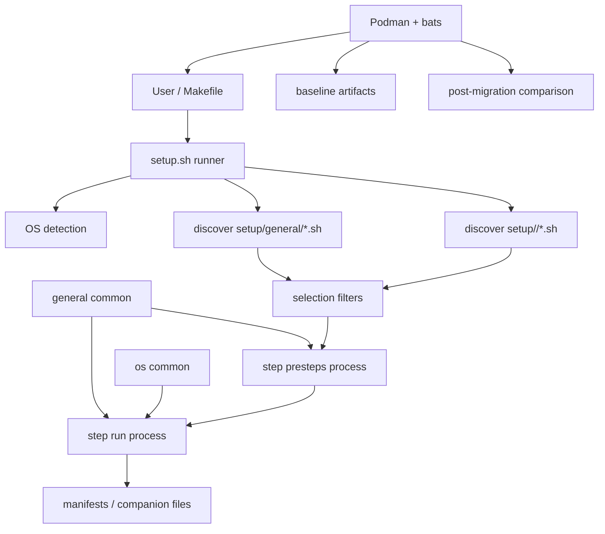

# Requirements

### Overview & Goals
Refactor the repo’s OS setup system into a numbered step-script architecture, with a Podman + Makefile + bats-core harness established **before** migration. The migration must preserve current macOS, Fedora, Fedora Atomic, and Manjaro setup behavior while making the setup process discoverable, selectively runnable, and idempotent.

### In Scope
- Replace the current monolithic/platform-script model with:
  - Root `setup.sh` as the only entry point.
  - New `setup/` directory containing exactly the platform step directories requested: `general/`, `macos/`, `manjaro/`, `fedora/`, `fedora-atomic/`.
  - Numbered executable step scripts such as `01-base.sh`, `02-zsh.sh`, run in lexical order.
- Execute `general/` steps first, then the detected OS-specific directory.
- Implement CLI selection modes:
  - default/all: run all discovered applicable steps.
  - include-only: run exactly selected step IDs/names after discovery and ordering.
  - exclude: run all discovered applicable steps except selected step IDs/names.
  - `--interactive`: show an `fzf --multi` checklist when `fzf` is available; otherwise print a clear fallback message and require/accept flag-based selection.
- Enforce a step contract where every step script dispatches on `$1` to `presteps`, `help`, and `run`.
- Share as much setup behavior as possible through `setup/general/`, while keeping platform-dependent work out of it:
  - Runnable `general/` steps cover only truly OS-agnostic work.
  - Non-executable helpers in `setup/general/common.bash` provide only platform-neutral primitives such as logging, manifest parsing, symlink handling, directory creation, text-file edits, and guarded Git clones.
  - Flatpak, package-manager logic, installer/downloader workflows, GUI app installers, and OS-specific service/shell behavior stay in the relevant OS directory.
- Split the current large per-OS scripts into small, focused numbered steps rather than broad “do everything for this OS” scripts.
- Treat idempotency as a hard requirement: repeated full runs and repeated selected-step runs must be safe and should no-op when the desired state already exists.
- Add a Podman-driven `Makefile` test matrix with bats-core tests:
  - `make test-fedora`
  - `make test-manjaro`
  - `make test-fedora-atomic`
  - `make test-macos`
  - optional aggregate `make test`
- Establish the harness against the **current** scripts first, run it, and record baseline pass/fail/skip results before migration.
- Re-run the same tests after migration and compare against baseline.

### Out of Scope
- No implementation in this planning step.
- No conversion to a different shell language; continue using Bash-style scripts.
- No CI provider setup unless added later as a separate task.
- No guaranteed real macOS execution inside Podman; `test-macos` uses a mocked Darwin/Homebrew environment as required.

### User Choices Applied
- **Test harness strategy:** favor real package-manager execution inside disposable containers wherever practical; macOS remains mocked, and Fedora Atomic may fall back to a documented `rpm-ostree` mock if no practical rpm-ostree-capable image works.
- **Step selection semantics:** include-only means **exactly the selected discovered steps** run; `general/` steps are not implicitly added unless selected.
- **Baseline strictness:** record baseline pass/fail/skip artifacts without blocking migration on known current-script limitations.
- **Latest refinement:** maximize truly OS-agnostic shared logic in `setup/general/`, keep Flatpak and installer/downloader logic OS-specific, make every step idempotent, and split current setup files into smaller chunks.

# Technical Design

### Current Implementation
- `setup.sh` currently mixes base setup and dispatch:
  - Defines `link_path()` and `setup_symlinks()` for dotfile symlinks.
  - Links `zshrc`, `vimrc`, `gitconfig`, `vim/`, `nvim/`, `lazygit/`, `junie/`, `ghostty/`, `Nextcloud/`, and selected `ssh/` files.
  - Calls `setup.git-filters.sh` from `setup_symlinks()`.
  - Detects OS using `uname -s`, `/etc/fedora-release`, `/etc/manjaro-release`, and `rpm-ostree` availability.
  - Dispatches to `setup.macos.sh`, `setup.fedora.sh`, `setup.atomic-fedora.sh`, or `setup.manjaro.sh`.
- `setup.macos.sh` handles Homebrew installation, `packages/macos/Brewfile`, SSH agent/keychain setup, and the Dracula Vim theme.
- `setup.fedora.sh` handles `dnf`, COPR, Flatpak, ZSH plugins, tealdeer/Vim directories, JetBrains Toolbox, Proton Bridge, Bun, Junie, and Tailscale.
- `setup.atomic-fedora.sh` handles `rpm-ostree`, Flatpak, toolbox creation/package installation, and toolbox extras for `latex`, `mobile`, and `cli-dev`.
- `setup.manjaro.sh` handles `pacman`, AUR via `yay`, ZSH plugins, shell/default services, CUPS/firewall/clamav, and scripts under `packages/manjaro/external/`.
- Repeated behavior should be shared only where platform-neutral. `setup/general/common.bash` should cover manifest parsing, directory creation, symlink checks, guarded Git clones, and other shell primitives; Flatpak guards, default-shell changes, package-manager operations, JetBrains Toolbox installation, version-manager installers, and downloaded archive/executable workflows should be implemented in OS-specific steps or OS-specific helper companions.
- `packages/` currently stores manifests and executable Manjaro external scripts:
  - `packages/macos/Brewfile` plus tracked `Brewfile.old*` backups.
  - `packages/fedora/{dnf.txt,flatpak.txt,copr.txt}`.
  - `packages/fedora-atomic/{rpm-ostree.txt,flatpak.txt,toolboxes.txt,toolboxes/*.txt}`.
  - `packages/manjaro/{pacman.txt,aur.txt,external/*.sh}`.
- `README.md` documents the current setup layout and must be updated after migration.

### Target Runner Behavior
Root `setup.sh` becomes orchestration-only:
1. Resolve `REPO_DIR`.
2. Detect platform:
   - `Darwin` → `macos`.
   - Linux + `/etc/fedora-release` + `rpm-ostree` → `fedora-atomic`.
   - Linux + `/etc/fedora-release` without `rpm-ostree` → `fedora`.
   - Linux + `/etc/manjaro-release` → `manjaro`.
3. Discover executable `*.sh` steps in:
   - `setup/general/`
   - `setup/$OS_ID/`
4. Build an ordered step list: all `general/` scripts first, then all OS-specific scripts, each sorted lexically by filename.
5. Apply selection filters:
   - default/`--all`: keep all discovered steps.
   - include-only: keep exactly selected step IDs/names.
   - exclude: drop selected step IDs/names.
   - `--interactive`: if `fzf` exists, list discovered steps with help text and run selected entries; if absent, exit with a clear message showing equivalent flag usage.
6. For each selected step, run:
   - `./step.sh presteps`
   - `./step.sh run`
7. Run steps as separate processes, never by sourcing them.
8. Print a summary of executed, skipped, and failed steps.

### Step Identity and Selection
Each discovered step has stable selectors:
- Fully qualified ID: `<scope>/<filename>`, e.g. `general/01-symlinks.sh`.
- Filename shorthand when unambiguous, e.g. `01-symlinks.sh`.
- Basename without extension when unambiguous, e.g. `01-symlinks`.

Explicit include-only examples:
```bash
./setup.sh --only general/01-symlinks.sh
./setup.sh --only fedora/06-flatpak-apps.sh,fedora/08-zsh-plugins.sh
./setup.sh --interactive
```

### Exact Step Interface Template
Every step script should use this template shape. Steps may source `setup/general/common.bash` for platform-neutral primitives; OS-specific steps may also source a non-executable `setup/<os>/common.bash` for platform-dependent helpers such as Flatpak, package-manager, downloader, or installer guards. Helper files are not executable and are not discovered as steps.
```bash
#!/usr/bin/env bash
set -euo pipefail

SCRIPT_DIR="$(cd "$(dirname "${BASH_SOURCE[0]}")" && pwd)"
REPO_DIR="$(cd "$SCRIPT_DIR/../.." && pwd)"

# shellcheck source=../general/common.bash

source "$REPO_DIR/setup/general/common.bash"

if [[ "$SCRIPT_DIR" != "$REPO_DIR/setup/general" && -f "$SCRIPT_DIR/common.bash" ]]; then
  # shellcheck source=common.bash
  source "$SCRIPT_DIR/common.bash"
fi

presteps() {
  # Required preconditions only; fail fast with actionable messages.
  # Example: require_command git
  return 0
}

help() {
  cat <<'EOF'
Short description of what this step configures and what state it ensures.
EOF
}

run() {
  # Idempotent setup logic. Check current state before every mutation.
  return 0
}

case "${1:-}" in
  presteps) presteps ;;
  help) help ;;
  run) run ;;
  *)
    printf 'usage: %s {presteps|help|run}\n' "$(basename "$0")" >&2
    exit 2
    ;;
esac
```

### Shared General Strategy
`setup/general/` is the shared-code location for platform-neutral behavior only. It contains runnable general steps and a non-executable `common.bash` helper library:
- `setup/general/common.bash` — shared primitive helpers such as `log`, `die`, `require_command`, `read_manifest`, `ensure_dir`, `ensure_symlink`, `ensure_git_config`, `ensure_git_clone`, `ensure_line_present`, and `command_exists`.
- Runnable `general/*.sh` steps are limited to OS-agnostic work that can safely run before OS-specific package installation.
- `setup/general/common.bash` must not contain Flatpak helpers, package-manager wrappers, GUI app installers, network downloader/installers, `brew`/`dnf`/`pacman`/`rpm-ostree`/`yay` logic, or OS service/shell mutation logic.
- OS-specific directories may include their own non-executable `common.bash` companion for platform-dependent helpers used by multiple steps in that OS directory.
- If a workflow can share only primitive mechanics, keep those primitives in `setup/general/common.bash` and keep the executable step plus platform-specific helper code in the relevant OS directory.

### Idempotency Rules
Every `run()` must prove or query current state before making changes:
- Symlinks are changed only when the target differs; backups are created once with deterministic names or skipped when already backed up.
- Package steps use OS-specific package-manager no-op features or pre-query installed state (`dnf`, `rpm-ostree`, `pacman`, `yay`, `brew`, `flatpak`) before installing.
- Flatpak, Homebrew, rpm-ostree, dnf, pacman/yay, and service checks live in the relevant OS directory, not in `setup/general/common.bash`.
- Git clone steps check for an existing checkout and optionally fast-forward/update only when safe.
- Download/install steps live in the relevant OS directory and check the final executable, app, directory, or version before downloading; temporary archives are cleaned.
- Service steps check availability and current enabled/running/operator state before calling `systemctl`, `tailscale`, or similar commands.
- `presteps()` validates prerequisites but does not mutate state; `help()` only prints.

### Proposed Step Mapping
`general/`:
- `setup/general/common.bash` — non-executable platform-neutral helper library for all steps.
- `setup/general/01-symlinks.sh` — move `setup.sh` symlink/linking logic here, including `$HOME/.config`, `$HOME/.ssh`, and idempotent backup/link behavior.
- `setup/general/02-git-filters.sh` — move or replace `setup.git-filters.sh`; register `pkcs11-provider` and `scrub-apikey` filters idempotently.
- `setup/general/03-vim-base.sh` — create shared Vim directories such as `$HOME/.vim/undo` and other OS-agnostic editor directories only; any theme download/install remains OS-specific.

`macos/`:
- `setup/macos/common.bash` — non-executable macOS helper library for Homebrew, keychain, and macOS-specific downloader/installer guards.
- `setup/macos/01-homebrew.sh` — current `ensure_homebrew()` behavior, guarded by `command -v brew`.
- `setup/macos/02-brew-bundle.sh` — move `packages/macos/Brewfile` to `setup/macos/Brewfile` and run `brew bundle --file` only after Homebrew is available.
- `setup/macos/03-ssh-agent.sh` — current SSH agent startup checks from `ensure_ssh_agent()`.
- `setup/macos/04-ssh-keychain.sh` — current `add_ssh_keys_to_keychain()` behavior, guarded so already-added keys are not repeatedly added.
- `setup/macos/05-vim-theme.sh` — current macOS Vim theme install logic, made idempotent and kept out of `general/` because it downloads/installs platform-specific assets.

`fedora/`:
- `setup/fedora/common.bash` — non-executable Fedora helper library for `dnf`, COPR, Flatpak, service, and Fedora-specific downloader/installer guards.
- `setup/fedora/01-system-update.sh` — `sudo dnf -y upgrade --refresh`.
- `setup/fedora/02-copr-repos.sh` — COPR enablement from `copr.txt`, checking enabled repos before calling `dnf copr enable`.
- `setup/fedora/03-dnf-packages.sh` — move `packages/fedora/dnf.txt` to `setup/fedora/dnf.txt`; install missing packages with `sudo dnf install -y`.
- `setup/fedora/04-copr-packages.sh` — install the hardcoded COPR-dependent packages currently in `setup.fedora.sh` (`lazygit`, `scrcpy`, `codium`, `steam`, `proton-vpn-gnome-desktop`) or move them to a focused companion manifest.
- `setup/fedora/05-flatpak-runtime.sh` — install/verify Flatpak and ensure Flathub exists.
- `setup/fedora/06-flatpak-apps.sh` — move `packages/fedora/flatpak.txt` to `setup/fedora/flatpak.txt`; install only missing Flatpak apps.
- `setup/fedora/07-default-shell.sh` — perform Fedora-specific default-shell checks after packages are installed.
- `setup/fedora/08-zsh-plugins.sh` — install/update ZSH plugins using platform-neutral Git clone primitives plus Fedora-specific prerequisites.
- `setup/fedora/09-tealdeer.sh` — create `$HOME/.config/tealdeer` and run `tldr --update` only when `tldr` is present.
- `setup/fedora/10-jetbrains-toolbox.sh` — use Fedora-specific guarded downloader/installer logic and avoid launching repeatedly on every run.
- `setup/fedora/11-proton-bridge.sh` — install Proton Bridge only when the package/app is absent, using Fedora-specific package/download checks.
- `setup/fedora/12-bun.sh` — use Fedora-specific guarded installer logic only when `bun` is absent.
- `setup/fedora/13-junie.sh` — use Fedora-specific guarded installer logic only when Junie is absent.
- `setup/fedora/14-tailscale.sh` — enable/start Tailscale and set operator only when needed and supported.

`fedora-atomic/`:
- `setup/fedora-atomic/common.bash` — non-executable Fedora Atomic helper library for `rpm-ostree`, Flatpak, toolbox, and Atomic-specific downloader/installer guards.
- `setup/fedora-atomic/01-system-upgrade.sh` — `sudo rpm-ostree upgrade`.
- `setup/fedora-atomic/02-host-packages.sh` — move `rpm-ostree.txt`; layer only missing host packages where detectable.
- `setup/fedora-atomic/03-default-shell.sh` — perform Fedora Atomic-specific default-shell checks after layered package checks.
- `setup/fedora-atomic/04-zsh-plugins.sh` — install/update ZSH plugins using platform-neutral Git clone primitives plus Atomic-specific prerequisites.
- `setup/fedora-atomic/05-tealdeer.sh` — create tealdeer/Vim support directories and update `tldr` when available.
- `setup/fedora-atomic/06-flatpak-remote.sh` — ensure Flathub exists.
- `setup/fedora-atomic/07-flatpak-apps.sh` — move `flatpak.txt`; install only missing apps.
- `setup/fedora-atomic/08-toolbox-create.sh` — move `toolboxes.txt`; create only missing toolboxes.
- `setup/fedora-atomic/09-toolbox-packages.sh` — move `toolboxes/*.txt`; install per-toolbox packages with guarded `toolbox run` calls.
- `setup/fedora-atomic/10-toolbox-latex.sh` — LTEX LS extras, guarded by final binary/path checks.
- `setup/fedora-atomic/11-toolbox-mobile.sh` — `ktlint` and `swiftlint` extras, guarded by executable/version checks.
- `setup/fedora-atomic/12-toolbox-cli-dev.sh` — Jabba/Pyenv/NVM extras, using Fedora Atomic/toolbox-specific guarded installer checks.
- `setup/fedora-atomic/99-reboot-notice.sh` — print rpm-ostree reboot notice only when layering requested/changed if detectable.

`manjaro/`:
- `setup/manjaro/common.bash` — non-executable Manjaro helper library for `pacman`, `yay`, services, AUR, and Manjaro-specific downloader/installer guards.
- `setup/manjaro/01-system-update.sh` — `sudo pacman -Syu --noconfirm` with container-aware handling.
- `setup/manjaro/02-pacman-packages.sh` — move `pacman.txt`; install missing packages with `pacman -S --needed`.
- `setup/manjaro/03-yay-bootstrap.sh` — ensure `yay` exists before AUR package installation.
- `setup/manjaro/04-aur-packages.sh` — move `aur.txt`; install missing AUR packages with `yay -S --needed`.
- `setup/manjaro/05-default-shell.sh` — perform Manjaro-specific default-shell checks after packages are installed.
- `setup/manjaro/06-zsh-plugins.sh` — install/update ZSH plugins using platform-neutral Git clone primitives plus Manjaro-specific prerequisites.
- `setup/manjaro/07-printing.sh` — CUPS package/service setup with current-state checks.
- `setup/manjaro/08-firewall.sh` — nftables/ufw setup with current-state checks.
- `setup/manjaro/09-clamav.sh` — ClamAV service/update setup with current-state checks.
- `setup/manjaro/10-jetbrains-toolbox.sh` — port `external/10-jetbrains-toolbox.sh` using Manjaro-specific guarded downloader/installer logic.
- `setup/manjaro/11-jabba.sh` — port `external/20-jabba.sh` using Manjaro-specific guarded installer checks.
- `setup/manjaro/12-joplin.sh` — port `external/30-joplin.sh` with final app/executable checks.
- `setup/manjaro/13-cisco-note.sh` — port `external/40-cisco-note.sh` as an idempotent note/artifact step.
- `setup/manjaro/14-celeste-note.sh` — port `external/50-celeste-note.sh` as an idempotent note/artifact step.

### Concrete File List
Create:
- `Makefile`
- `tests/README.md`
- `tests/containers/Containerfile.fedora`
- `tests/containers/Containerfile.manjaro`
- `tests/containers/Containerfile.fedora-atomic`
- `tests/containers/Containerfile.macos-mock`
- `tests/bats/helpers/common.bash`
- `tests/bats/helpers/assertions.bash`
- `tests/bats/smoke.bats`
- `tests/bats/idempotency.bats`
- `tests/bats/assertions-fedora.bats`
- `tests/bats/assertions-manjaro.bats`
- `tests/bats/assertions-fedora-atomic.bats`
- `tests/bats/assertions-macos.bats`
- `tests/baselines/README.md`
- `setup/general/common.bash`
- `setup/general/01-symlinks.sh`
- `setup/general/02-git-filters.sh`
- `setup/general/03-vim-base.sh`
- `setup/macos/common.bash`
- `setup/macos/01-homebrew.sh`
- `setup/macos/02-brew-bundle.sh`
- `setup/macos/03-ssh-agent.sh`
- `setup/macos/04-ssh-keychain.sh`
- `setup/macos/05-vim-theme.sh`
- `setup/fedora/common.bash`
- `setup/fedora/01-system-update.sh`
- `setup/fedora/02-copr-repos.sh`
- `setup/fedora/03-dnf-packages.sh`
- `setup/fedora/04-copr-packages.sh`
- `setup/fedora/05-flatpak-runtime.sh`
- `setup/fedora/06-flatpak-apps.sh`
- `setup/fedora/07-default-shell.sh`
- `setup/fedora/08-zsh-plugins.sh`
- `setup/fedora/09-tealdeer.sh`
- `setup/fedora/10-jetbrains-toolbox.sh`
- `setup/fedora/11-proton-bridge.sh`
- `setup/fedora/12-bun.sh`
- `setup/fedora/13-junie.sh`
- `setup/fedora/14-tailscale.sh`
- `setup/fedora-atomic/common.bash`
- `setup/fedora-atomic/01-system-upgrade.sh`
- `setup/fedora-atomic/02-host-packages.sh`
- `setup/fedora-atomic/03-default-shell.sh`
- `setup/fedora-atomic/04-zsh-plugins.sh`
- `setup/fedora-atomic/05-tealdeer.sh`
- `setup/fedora-atomic/06-flatpak-remote.sh`
- `setup/fedora-atomic/07-flatpak-apps.sh`
- `setup/fedora-atomic/08-toolbox-create.sh`
- `setup/fedora-atomic/09-toolbox-packages.sh`
- `setup/fedora-atomic/10-toolbox-latex.sh`
- `setup/fedora-atomic/11-toolbox-mobile.sh`
- `setup/fedora-atomic/12-toolbox-cli-dev.sh`
- `setup/fedora-atomic/99-reboot-notice.sh`
- `setup/manjaro/common.bash`
- `setup/manjaro/01-system-update.sh`
- `setup/manjaro/02-pacman-packages.sh`
- `setup/manjaro/03-yay-bootstrap.sh`
- `setup/manjaro/04-aur-packages.sh`
- `setup/manjaro/05-default-shell.sh`
- `setup/manjaro/06-zsh-plugins.sh`
- `setup/manjaro/07-printing.sh`
- `setup/manjaro/08-firewall.sh`
- `setup/manjaro/09-clamav.sh`
- `setup/manjaro/10-jetbrains-toolbox.sh`
- `setup/manjaro/11-jabba.sh`
- `setup/manjaro/12-joplin.sh`
- `setup/manjaro/13-cisco-note.sh`
- `setup/manjaro/14-celeste-note.sh`

Move:
- `packages/macos/Brewfile` → `setup/macos/Brewfile`
- `packages/fedora/dnf.txt` → `setup/fedora/dnf.txt`
- `packages/fedora/flatpak.txt` → `setup/fedora/flatpak.txt`
- `packages/fedora/copr.txt` → `setup/fedora/copr.txt`
- `packages/fedora-atomic/rpm-ostree.txt` → `setup/fedora-atomic/rpm-ostree.txt`
- `packages/fedora-atomic/flatpak.txt` → `setup/fedora-atomic/flatpak.txt`
- `packages/fedora-atomic/toolboxes.txt` → `setup/fedora-atomic/toolboxes.txt`
- `packages/fedora-atomic/toolboxes/*.txt` → `setup/fedora-atomic/toolboxes/*.txt`
- `packages/manjaro/pacman.txt` → `setup/manjaro/pacman.txt`
- `packages/manjaro/aur.txt` → `setup/manjaro/aur.txt`
- `packages/manjaro/external/10-jetbrains-toolbox.sh` → `setup/manjaro/10-jetbrains-toolbox.sh`
- `packages/manjaro/external/20-jabba.sh` → `setup/manjaro/11-jabba.sh`
- `packages/manjaro/external/30-joplin.sh` → `setup/manjaro/12-joplin.sh`
- `packages/manjaro/external/40-cisco-note.sh` → `setup/manjaro/13-cisco-note.sh`
- `packages/manjaro/external/50-celeste-note.sh` → `setup/manjaro/14-celeste-note.sh`

Modify:
- `setup.sh` — rewrite into the runner/dispatcher only.
- `README.md` — update quick start, layout, setup system docs, package manifest paths, and test harness docs.
- `.gitignore` — add test/baseline artifact ignores only if generated logs are not meant to be tracked.

Delete after migration:
- `setup.macos.sh`
- `setup.fedora.sh`
- `setup.atomic-fedora.sh`
- `setup.manjaro.sh`
- `setup.git-filters.sh` after its behavior is represented by `setup/general/02-git-filters.sh`.
- `packages/` after all manifests and companion scripts are moved.
- `packages/macos/Brewfile.old`, `Brewfile.old.20260331072104`, and `Brewfile.old.20260615082215` unless intentionally preserved as companion historical files.

### Architecture Diagram


### Key Risks and Mitigations
- **macOS testability limits:** Podman cannot run real macOS. `test-macos` will use a Linux container with mocked `uname`, `brew`, `ssh-agent`, and `ssh-add` behavior; the plan should clearly label this as contract/path validation, not full macOS validation.
- **Fedora Atomic in containers:** Real `rpm-ostree` may not function in ordinary containers. Start with an rpm-ostree-capable image; if impractical, use a documented fallback mock for `rpm-ostree` while keeping real Flatpak/toolbox tests where possible.
- **Real package installs are slow/flaky:** The user selected real installs. Keep containers disposable, allow per-OS targets, and record baseline results so network/repository failures are visible rather than hidden.
- **Idempotency gaps:** Current `install_toolbox()` launches Toolbox every run, Proton/Bun/Junie installers may rerun, and some downloads are not guarded. Migration must add explicit checks before download/install/launch; a step is incomplete until its second run is a safe no-op or an explicitly documented package-manager no-op.
- **General-first ordering:** Some workflows, such as ZSH plugin setup or default shell changes, depend on packages installed by OS-specific steps. Keep only platform-neutral primitives in `setup/general/common.bash`; schedule the executable step and any Flatpak/package-manager/installer/downloader helper code in the OS-specific directory when it must run after OS package installation.
- **`chsh` and system services in containers:** `chsh`, `systemctl enable --now`, Tailscale, CUPS, firewall, and ClamAV may be limited in containers; tests should assert graceful behavior or mark known baseline limitations.
- **Tracked historical Brewfiles:** Existing `Brewfile.old*` files need a deliberate delete-or-preserve decision during migration.
- **Platform-dependent over-sharing:** Flatpak, installer/downloader, package-manager, and service helpers are easy to over-generalize but differ by OS. Keep them in `setup/<os>/common.bash` or the individual OS step, even if this causes some duplication.
- **Runner complexity:** Keep `setup.sh` orchestration-only and avoid embedding package setup logic back into the runner.

# Testing

### Validation Approach
The test harness is built before migration and run against the current scripts. Results are recorded as baseline artifacts, then the same test targets are run after migration and compared. Since the selected strategy favors real installs, Linux containers should run actual package managers where practical; macOS remains mocked and Fedora Atomic has a documented fallback if real `rpm-ostree` is not viable.

### Makefile Matrix
- `make test-fedora` — build/run Fedora container and execute bats.
- `make test-manjaro` — build/run Manjaro container and execute bats.
- `make test-fedora-atomic` — build/run Atomic-capable container or fallback mock container and execute bats.
- `make test-macos` — build/run mocked macOS environment and execute bats.
- `make test` — run the full matrix.
- `make baseline` — run current-script matrix and store results under `tests/baselines/`.
- `make compare-baseline` — compare post-migration bats summaries/logs with recorded baseline.

### Bats Layers
1. **Smoke**
   - Current phase: invoke existing `setup.sh` under each OS/container target.
   - Migrated phase: invoke new `setup.sh` runner for each OS/container target.
   - Assert the command exits successfully or records expected known skips.
2. **Idempotency**
   - Run setup twice in the same container/home directory.
   - Assert the second run exits cleanly and reports already-satisfied state wherever possible.
   - Assert no duplicate symlink backups, repeated clone directories, repeated Flatpak remotes, repeated toolbox creation failures, repeated downloads, repeated GUI launches, or repeated package requests where installed-state queries are practical.
3. **Assertions**
   - Assert expected files, symlinks, directories, package-manager state, and service configuration outcomes.

### Per-OS Test Cases
Fedora:
- Smoke: current `setup.sh` detects Fedora and dispatches to `setup.fedora.sh`; migrated runner detects `fedora` and discovers `general/` + `fedora/` steps.
- Idempotency: second run of symlinks, COPR enabling, `dnf install`, Flatpak remote/app setup, default shell, ZSH plugin clone checks, tealdeer/Vim setup, JetBrains Toolbox, Proton Bridge, Bun/Junie guards, and Tailscale service step is safe.
- Assertions: `~/.zshrc`, `~/.vimrc`, `~/.gitconfig`, `~/.config/nvim`, `~/.config/lazygit`, `~/.ssh/config`; `dnf` packages from `setup/fedora/dnf.txt`; COPRs from `setup/fedora/copr.txt`; Flatpaks from `setup/fedora/flatpak.txt`; `~/.zsh/zsh-autosuggestions`, `~/.zsh/zsh-syntax-highlighting`, `~/.zsh/zsh-autocomplete`.

Manjaro:
- Smoke: current `setup.sh` detects `/etc/manjaro-release`; migrated runner detects `manjaro` and discovers `general/` + `manjaro/` steps.
- Idempotency: `pacman -S --needed`, `yay -S --needed`, yay bootstrap, default shell, ZSH plugin clones, printing/firewall/clamav services, JetBrains Toolbox, Jabba, Joplin, and note steps are safe on second run.
- Assertions: dotfile symlinks; packages from `setup/manjaro/pacman.txt`; AUR install attempts/results from `setup/manjaro/aur.txt`; `yay` availability; ZSH plugin directories; service commands for CUPS/firewall/clamav behave or are recorded as container-limited.

Fedora Atomic:
- Smoke: current `setup.sh` chooses Atomic when `rpm-ostree` is present; migrated runner detects `fedora-atomic` and discovers `general/` + `fedora-atomic/` steps.
- Idempotency: `rpm-ostree` upgrade/layering, default shell, ZSH plugins, tealdeer/Vim setup, Flatpak remote/app installation, toolbox creation, toolbox package installs, and each toolbox extra step are safe on repeat.
- Assertions: host package list from `setup/fedora-atomic/rpm-ostree.txt`; Flatpaks from `setup/fedora-atomic/flatpak.txt`; toolboxes from `setup/fedora-atomic/toolboxes.txt`; per-toolbox packages from `setup/fedora-atomic/toolboxes/*.txt`; extras such as LTEX LS path, `ktlint`, `swiftlint`, Jabba/Pyenv/NVM directories when feasible.

macOS mock:
- Smoke: mocked `uname -s` returns `Darwin`; current `setup.sh` dispatches to `setup.macos.sh`; migrated runner detects `macos` and discovers `general/` + `macos/` steps.
- Idempotency: mocked Homebrew install path, `brew bundle`, SSH agent/keychain calls, shared Vim directory setup, and macOS-specific Vim theme logic are repeat-safe.
- Assertions: expected symlinks; `brew bundle --file=setup/macos/Brewfile` invocation; mocked `ssh-add --apple-use-keychain`; no Linux OS-specific steps run.

### Runner-Specific Tests
- `./setup.sh --help` documents OS detection, selection flags, and examples.
- `./setup.sh --list` prints ordered discovered steps with help descriptions.
- `./setup.sh --only general/01-symlinks.sh` runs exactly that step.
- `./setup.sh --exclude fedora/14-tailscale.sh` runs all applicable Fedora steps except Tailscale services.
- `./setup.sh --interactive` uses `fzf --multi` when present.
- `./setup.sh --interactive` falls back gracefully when `fzf` is absent.
- Unknown step selectors fail with a clear error.
- Non-executable or malformed step scripts are skipped or fail according to documented runner behavior.

### Baseline Artifacts
- Store summaries/logs such as:
  - `tests/baselines/fedora.txt`
  - `tests/baselines/manjaro.txt`
  - `tests/baselines/fedora-atomic.txt`
  - `tests/baselines/macos.txt`
- Record each target as pass/fail/skip with notes for container limitations.
- Compare post-migration summaries against baseline, accepting intentional differences only when documented.

# Delivery Steps

### ✓ Step 1: Build Podman bats test harness for current scripts
A Makefile-driven Podman and bats-core matrix exists and can run against the current setup scripts.

- Add `Makefile` targets for `test-fedora`, `test-manjaro`, `test-fedora-atomic`, `test-macos`, aggregate `test`, `baseline`, and `compare-baseline`.
- Add Containerfiles under `tests/containers/` for Fedora, Manjaro, Fedora Atomic, and macOS mock targets.
- Add shared bats helpers under `tests/bats/helpers/` for command execution, OS simulation, and assertions.
- Add bats smoke, idempotency, and per-OS assertion files that initially invoke the existing `setup.sh` / platform scripts.
- Prefer real package-manager execution in disposable Linux containers; keep macOS mocked and document any Fedora Atomic `rpm-ostree` fallback.

### ✓ Step 2: Run and record baseline results
Current-script behavior is captured as a non-blocking baseline for all supported OS targets.

- Run the full Makefile matrix before migration.
- Save pass/fail/skip summaries and relevant logs under `tests/baselines/`.
- Annotate known current limitations such as container `systemctl`, `chsh`, Tailscale, external network installers, macOS mock-only coverage, and any Fedora Atomic `rpm-ostree` constraints.
- Ensure baseline recording does not require all current tests to pass before migration proceeds.

### ✓ Step 3: Implement setup runner and numbered step structure
The root `setup.sh` becomes an orchestration-only runner and setup logic moves into numbered step scripts.

- Rewrite `setup.sh` to detect OS, discover `setup/general/*.sh` and `setup/<os>/*.sh`, sort steps, apply `--all`, `--only`, `--exclude`, `--interactive`, `--list`, and `--help`, then run each step as a separate process via `presteps` and `run`.
- Create `setup/general/`, `setup/macos/`, `setup/manjaro/`, `setup/fedora/`, and `setup/fedora-atomic/` with executable numbered scripts following the required `presteps` / `help` / `run` dispatch template.
- Add `setup/general/common.bash` as the shared helper library for platform-neutral idempotent primitives; keep it non-executable so the runner does not treat it as a step.
- Preserve explicit selection semantics so include-only runs exactly the requested discovered steps.
- Move current symlink, git-filter, shared Vim directory, manifest-reading, and guarded clone primitives into `setup/general/` where possible without leaving setup logic in the runner.
- Keep Flatpak, shell mutation, package-manager, installer, and downloader behavior in OS-specific steps or OS-specific `common.bash` helper companions.

### ✓ Step 4: Port OS setup logic and manifests
All current macOS, Fedora, Fedora Atomic, and Manjaro setup behavior is represented as idempotent numbered steps with local companion data.

- Move package manifests from `packages/` into their corresponding `setup/<os>/` directories.
- Add `setup/macos/common.bash`, `setup/fedora/common.bash`, `setup/fedora-atomic/common.bash`, and `setup/manjaro/common.bash` for platform-dependent helpers reused within each OS.
- Port Homebrew/Brewfile, SSH agent/keychain, and macOS Vim theme logic into small `setup/macos/` steps that reuse only platform-neutral helpers from `general/` and keep macOS installer/downloader guards local.
- Split Fedora logic into focused `dnf`, COPR, Flatpak runtime, Flatpak apps, default shell, ZSH plugins, tealdeer, JetBrains Toolbox, Proton Bridge, Bun, Junie, and Tailscale steps with guards for repeat runs.
- Split Fedora Atomic logic into focused `rpm-ostree` upgrade, host packages, default shell, ZSH plugins, tealdeer, Flatpak remote, Flatpak apps, toolbox creation, toolbox packages, and individual toolbox-extra steps with idempotency checks.
- Split Manjaro logic into focused `pacman`, yay bootstrap, AUR, default shell, ZSH plugins, printing, firewall, ClamAV, JetBrains Toolbox, Jabba, Joplin, Cisco note, and Celeste note steps.
- Remove obsolete root platform scripts and the old `packages/` structure after parity is achieved.

### ✓ Step 5: Validate migrated architecture and update documentation
The migrated setup system is tested against the recorded baseline and documented for future maintenance.

- Re-run the same Makefile test matrix after migration.
- Compare results to `tests/baselines/`, documenting expected differences and regressions.
- Update `README.md` to describe the new `setup/` layout, step contract, step selection flags, interactive mode, package manifest locations, test harness, and idempotency expectations.
- Update `.gitignore` only for generated test logs/artifacts that should not be tracked.
- Ensure all step scripts are executable and that malformed or non-executable steps are handled according to runner documentation.